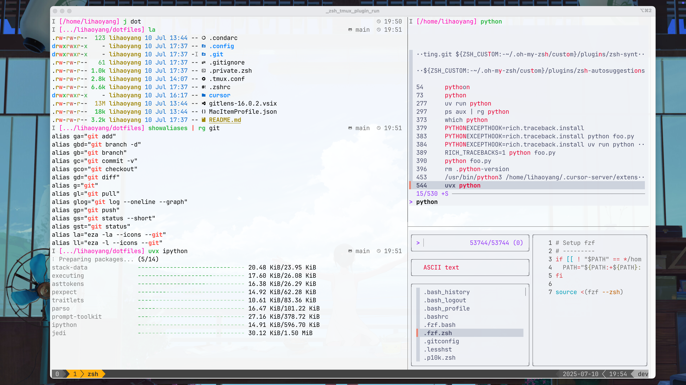
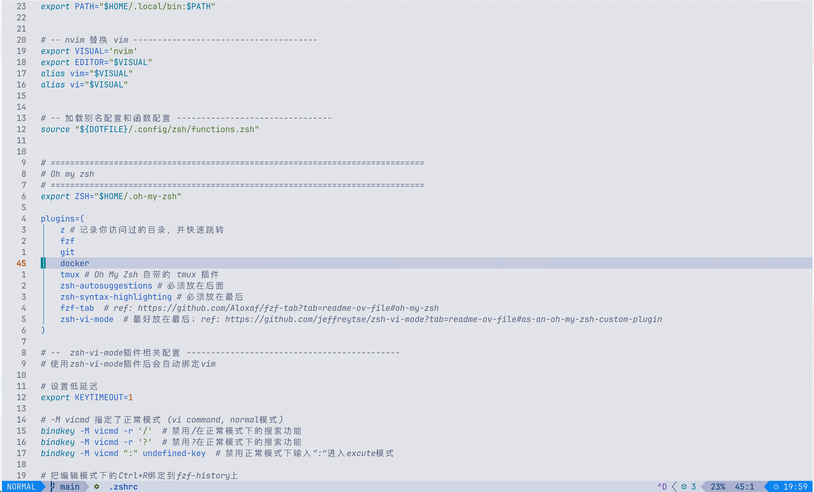

中文 | [English](README_en.md)

# Dotfiles Configuration

本仓库的目标：能在各种开发机（or 本地机）上无痛地setup起自己熟悉的开发环境，从而获得一致的开发体验

## 展示

<div align="center">
  <table style="border: none;">
    <tr>
      <td style="border: none;"></td>
      <td style="border: none;"></td>
    </tr>
    <tr>
      <td align="center" style="border: none;"><em>Screenshot</em></td>
      <td align="center" style="border: none;"><em>Vim Style</em></td>
    </tr>
  </table>
</div>

## 安装

1. 安装zsh shell

2. 克隆仓库

    ```bash
    git clone https://github.com/OleehyO/dotfiles.git ~/dotfiles
    ```

3. 安装依赖库（确保网络通畅）

    ```bash
    zsh  # 进入zsh shell

    source ~/dotfiles/.config/zsh/install/install_all.zsh
    ```

    > 如果安装过程中有某些依赖错误，建议手动进行安装，可以参考[install/目录](./.config/zsh/install/)

4. 创建软链接 & 拷贝文件
    > 记得提前备份好之前的.zshrc, .tmux.conf, .condarc, .config/

    ```bash
    cp ~/dotfiles/.zshrc ~/.zshrc
    cp ~/dotfiles/.tmux.conf ~/.tmux.conf
    cp ~/dotfiles/.condarc ~/.condarc

    mkdir ~/.config && cp -r ~/dotfiles/.config/* ~/.config/
    ```

5. 把zsh设置为默认shell

    > vscode中linux上的默认shell通常为bash，需要`cmd` + `,` 搜索terminal.integrated.defaultProfile.linux，设置为zsh

6. 重新加载终端

## VS Code / Cursor 集成终端设置

* 安装 Nerd Font 字体：推荐使用 [JetBrainsMono Nerd Font](https://github.com/ryanoasis/nerd-fonts/releases/download/v3.4.0/JetBrainsMono.zip)。

如果你使用VS Code的集成终端，请在 `settings.json` 中添加以下配置：

```json
{
  "terminal.integrated.fontFamily": "JetBrainsMono Nerd Font"
}
```

> 或"CMD" + ","然后搜索font

## 实用函数

所有函数定义在 `.config/zsh/functions.zsh` 文件中。

| 函数 | 描述 |
| :--- | :--- |
| `set_proxy [addr]` | 设置终端代理，默认地址为 `http://127.0.0.1:7890`。 |
| `unset_proxy` | 取消终端代理。 |
| `show_proxy` | 显示当前的代理状态。 |
| `update` | 根据操作系统，自动更新所有包 (`brew upgrade` 或 `apt upgrade`)。 |
| `install <pkg>` | 根据操作系统，自动安装指定的包。 |
| `remove <pkg>` | 根据操作系统，自动卸载指定的包。 |
| `search <pkg>` | 根据操作系统，自动搜索指定的包。 |
| `extract <file>` | 智能解压文件 (支持 `.tar`, `.zip` 等格式)。 |
| `compress <name> <files...>` | 智能压缩文件 (支持 `.tar`, `.zip` 等格式)。 |
| `backup <file>` | 快速备份文件，格式为 `filename.backup.YYYYMMDDHHMMSS`。 |
| `reload` | 重新加载 Zsh 配置，等同于 `source ~/.zshrc`。 |

## 常用别名

常用的别名定义在 `.config/zsh/aliases.zsh` 文件中，你可以通过 `showaliases` 函数查看所有别名。