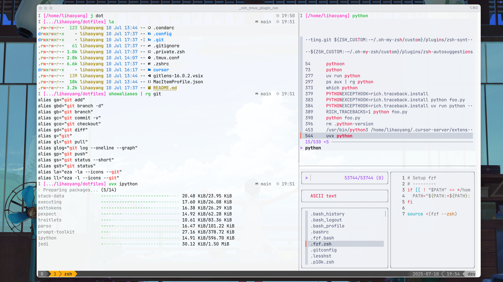
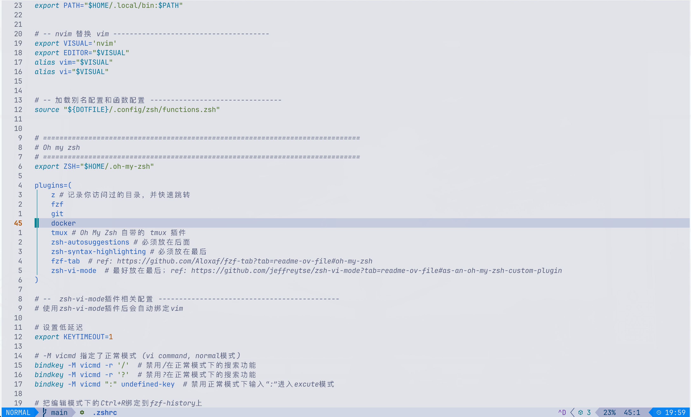

**Language**: [中文](README.md) | English

# Dotfiles Configuration

Target: Painlessly set up familiar development environments across various development machines for a consistent development experience.

## Showcase
<div align="center">
  <table style="border: none;">
    <tr>
      <td style="border: none;"></td>
      <td style="border: none;"></td>
    </tr>
    <tr>
      <td align="center" style="border: none;"><em>Screenshot</em></td>
      <td align="center" style="border: none;"><em>Vim Style</em></td>
    </tr>
  </table>
</div>

## Installation

1. Install zsh shell

2. Clone the repository

    ```bash
    git clone https://github.com/OleehyO/dotfiles.git ~/dotfiles
    ```

3. Install dependencies

    ```bash
    zsh  # Enter zsh shell

    source ~/dotfiles/.config/zsh/install/install_all.zsh
    ```

    > If there are dependency errors during installation, it's recommended to install manually. You can refer to the [install/ directory](./.config/zsh/install/)

4. Create symbolic links & copy file

    ```bash
    cp ~/dotfiles/.zshrc ~/.zshrc
    ln -s ~/dotfiles/.tmux.conf ~/.tmux.conf
    ln -s ~/dotfiles/.condarc ~/.condarc

    cp -r ~/dotfiles/.config/ ~
    ```

    > Remember to backup your previous .zshrc, .tmux.conf, .condarc, .config/ files

5. Set zsh as the default shell

    > The default shell in VS Code on Linux is usually bash. You need to press `cmd` + `,`, search for terminal.integrated.defaultProfile.linux, and set it to zsh

6. Reload terminal

## macOS User Guide

For the best visual experience, macOS users are recommended to make the following configurations.

* Install iTerm2: Download and install from [iTerm2 official website](https://iterm2.com/index.html).

* Install Nerd Font: Recommended to use [JetBrainsMono Nerd Font](https://github.com/ryanoasis/nerd-fonts/releases/download/v3.4.0/JetBrainsMono.zip).

* Import iTerm2 theme: This repository provides a preset iTerm2 theme configuration file `MacItemProfile.json`.

    1. Open iTerm2, go to *Settings* -> *Profiles*.
    2. Click *Other Actions...* -> *Import JSON Profiles...* in the bottom left.
    3. Select the `MacItemProfile.json` file from this repository.
    4. After importing, click *Other Actions...* -> *Set as Default* again to set it as the default configuration.

## VS Code / Cursor Integrated Terminal Settings

If you use VS Code's integrated terminal, please add the following configuration to `settings.json`:

```json
{
  "terminal.integrated.fontFamily": "JetBrainsMono Nerd Font"
}
```

> Or press "CMD" + "," and then search for font 

## Utility Functions

All functions are defined in the `.config/zsh/functions.zsh` file.

| Function | Description |
| :--- | :--- |
| `set_proxy [addr]` | Set terminal proxy, default address is `http://127.0.0.1:64991`. |
| `unset_proxy` | Unset terminal proxy. |
| `show_proxy` | Show current proxy status. |
| `update` | Automatically update all packages based on OS (`brew upgrade` or `apt upgrade`). |
| `install <pkg>` | Automatically install specified package based on OS. |
| `remove <pkg>` | Automatically uninstall specified package based on OS. |
| `search <pkg>` | Automatically search for specified package based on OS. |
| `extract <file>` | Smart file extraction (supports `.tar`, `.zip` and other formats). |
| `compress <name> <files...>` | Smart file compression (supports `.tar`, `.zip` and other formats). |
| `dirsize [dir]` | Show the size of current or specified directory. |
| `backup <file>` | Quick file backup, format: `filename.backup.YYYYMMDDHHMMSS`. |
| `editzsh` | Open `.zshrc` configuration file with default editor. |
| `editaliases` | Open aliases configuration file with default editor. |
| `editfunctions` | Open functions configuration file with default editor. |
| `reload` | Reload Zsh configuration, equivalent to `source ~/.zshrc`. |

## Common Aliases

Common aliases are defined in the `.config/zsh/aliases.zsh` file. You can view all aliases using the `showaliases` function.
